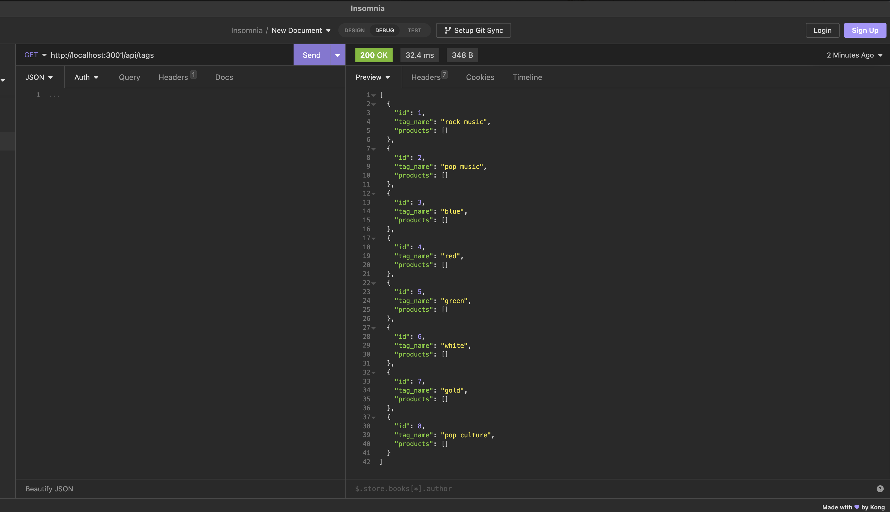

## E-Commerce Back End

This repository contains the back-end code for an E-Commerce application. It provides a robust and scalable API to manage various aspects of an online store, including products, categories, and tags. The back end is built using Node.js, Express.js, Sequelize ORM, and MySQL database.

## Installation

To run the E-Commerce back end on your local machine, follow these steps:

1. Clone this repository to your local machine: git clone git@github.com:tegaomare/e-commerce-backend.git

2. Navigate to the project directory: cd e-commerce-backend

3. Install the required dependencies using npm: npm i

4. Set up the database:

   Create a new MySQL database.

   Update the database connection configuration in the .env file with your MySQL database credentials.

5. Initialize the database:

   Run the following command to create the database tables: npm run db:create

   Run the following command to seed the database with initial data: npm run db:seed

6. Start the server:

   Run the following command to start the server: npm start

   The server will start listening on the specified port (default is 3001).

7. You can now access the E-Commerce back end API at http://localhost:3001.

## Usage

The E-Commerce back end provides several API routes for managing products, categories, and tags. You can use tools like Postman or Insomnia to interact with the API.

## walkthrough video

https://drive.google.com/file/d/15hMmvZBCA3n3M8QI9dIAe-zaK0j2hB6o/view

## API Routes

GET /api/categories: Retrieves all categories from the database.

GET /api/categories/:id: Retrieves a specific category by ID.

POST /api/categories: Creates a new category.

PUT /api/categories/:id: Updates a category by ID.

DELETE /api/categories/:id: Deletes a category by ID.

GET /api/products: Retrieves all products from the database.

GET /api/products/:id: Retrieves a specific product by ID.

POST /api/products: Creates a new product.

PUT /api/products/:id: Updates a product by ID.

DELETE /api/products/:id: Deletes a product by ID.

GET /api/tags: Retrieves all tags from the database.

GET /api/tags/:id: Retrieves a specific tag by ID.

POST /api/tags: Creates a new tag.

PUT /api/tags/:id: Updates a tag by ID.

DELETE /api/tags/:id: Deletes a tag by ID.

Make sure to replace :id in the routes above with the actual ID of the resource you want to interact with.

## Contributing

Contributions to this E-Commerce back end are welcome. If you find any issues or have suggestions for improvements, please submit a pull request.

## License

This project is licensed under the MIT License.

## Credits

Columbia University Coding Bootcamp

https://github.com/branchwag/ecommerce-backEnd/tree/main
